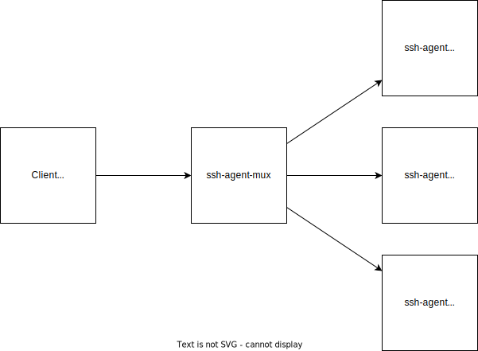

# ssh-agent-mux

An SSH agent that multiplexes other SSH agents.



## Status

This is a proof of concept.  Use at your own risk.

## Usage

```
# Run multiplex 3 agents
cargo run -- \
  --target unix://$HOME/.ssh/agent1.sock
  --target unix://$HOME/.ssh/agent2.sock
  --target unix://$HOME/.ssh/agentN.sock
  --host unix://$HOME/.ssh/mux.sock

# List keys from all 3 agents
SSH_AUTH_SOCK=$HOME/.ssh/mux.sock ssh-add -l
```

## License

Licensed under either of

 * Apache License, Version 2.0
   ([LICENSE-APACHE](LICENSE-APACHE) or http://www.apache.org/licenses/LICENSE-2.0)
 * MIT license
   ([LICENSE-MIT](LICENSE-MIT) or http://opensource.org/licenses/MIT)

at your option.

## Contribution

Unless you explicitly state otherwise, any contribution intentionally submitted
for inclusion in the work by you, as defined in the Apache-2.0 license, shall be
dual licensed as above, without any additional terms or conditions.
